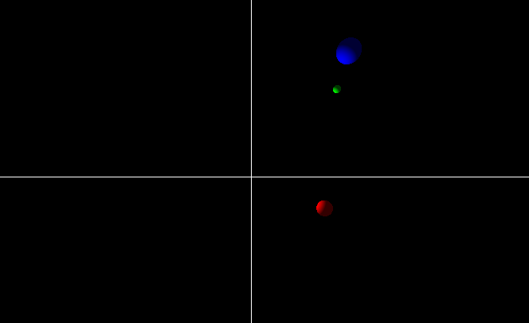
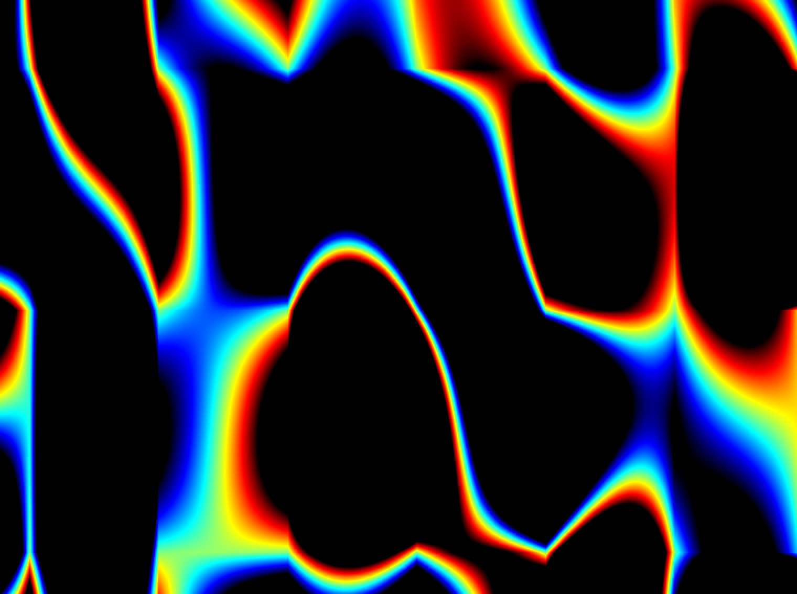

# demo fun 🕹

> This is my first take at writing _demo code_ or any C++ graphics. Spawned into existence during the 2018 revision party 👯‍


All commits are automatically compiled to ASM.js code and can be viewed from the respective GitLab artifact. Just follow the green ✔ next to the commit on GitHub.

A list of noteworthy (lol) commits:

| Description | Preview | ASM | Commit |
|-------------|---------|-----|--------|
| Colored rotating spheres arount a lightsource |  | [web](https://anoff.gitlab.io/-/demo-one/-/jobs/60587458/artifacts/out.html) | [33260db8](https://github.com/anoff/demo-one/tree/33260db8bdb1c9b992e397d82d66cabafcf51c55) |
| Rotating spots over _living_ Perlin noise |  | [web](https://anoff.gitlab.io/-/demo-one/-/jobs/60521678/artifacts/out.html) | [d9f9646](https://github.com/anoff/demo-one/tree/d9f9646b8a592df3cea18bc66139731f69669626) |
| Bugged _moving_ Perlin noise that ends up looking like flames |  | n/a | [f638eaa](https://github.com/anoff/demo-one/tree/f638eaa777b1a3ff46dc291b4805cc726e273499) |

## C++ 

```sh
make build && make run
```

## Autobuild

For ease of development the following commands will automatically build ASM.js output every time sources change and serve them to a web browser.

```sh
# build automatically if .cpp or .h files change using emscripten
make autobuild
# start up a live-reload server (npm i -g live-server)
make serve
```

## Compile to Javascript

Install emscripten

```sh
brew install emscripten
```

Make sure that the main loop is handled by emscripten and not automatically started in `main()`

```c++
  #ifdef __EMSCRIPTEN__
    // 0 fps means to use requestAnimationFrame; non-0 means to use setTimeout.
    emscripten_set_main_loop(loop, 0, 1);
  #else
    while (!quit) {
      loop();
      SDL_Delay(16);
    }
  #endif
```


```sh
# build html (and js)
em++ *.cpp -o out.html -s USE_SDL=2 --shell-file shell_minimal.html

# run stuff
open out.html
```

## License

Code is licensed under [MIT](./LICENSE)

### Attribution

- [SimplexNoise](https://github.com/SRombauts/SimplexNoise) by Sebastien Rombauts
